<h1>Gastro Reservation Webiste</h1>

    
Gastro is a Reservation website for a 24hr restaurant, the purpose of the site is for customers of the Gastro restaurant to be able to reserve seats in the restaurant without calling.  
    <a href="https://reservation-system-jca.herokuapp.com/">Click Here</a> to go to the live website.

This website follows the mobile first approach and is responsive for mobile devices as well as desktop.

<h1>User Experience (UX)</h1>
<h2>Goals</h2>
<ul>
    <li>Users can easily book and manage their reservations for the restaurant online.</li>
    <li>Show a clean, clear, accessible and easily navigable website for the user.</li>
    <li>Users return to show/recommend service to others.</li>
    <li>Frequent users connect via the social media platforms for information and updates.</li>
</ul>

<h1>Planning</h1>

<h2>Storyboard used <a href="https://github.com/users/Jca-Dev/projects/3">Here</a></h2>

I used figma wireframes to plan the look and layout of the project. After some review of the project I changed the color scheme of the website.

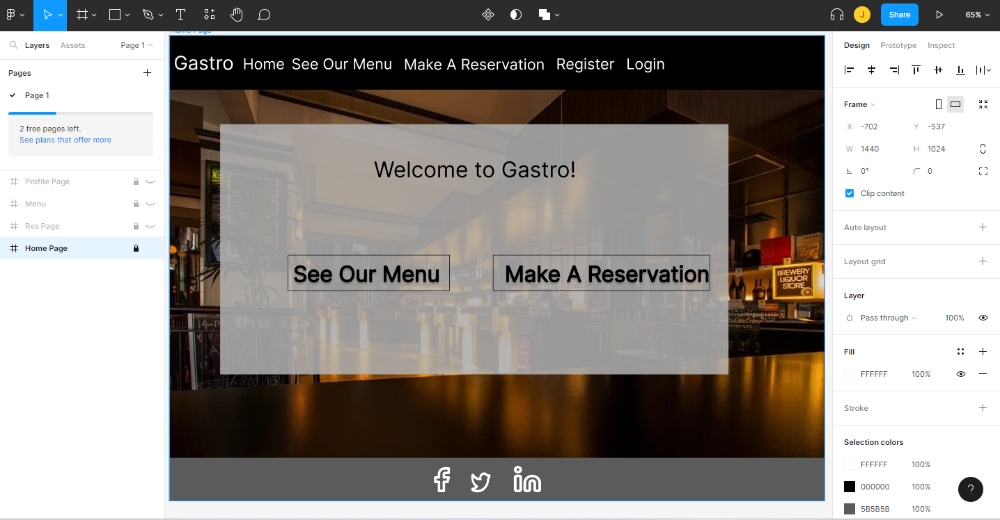

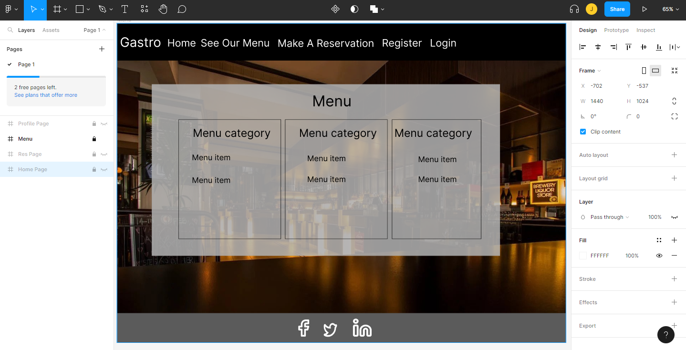

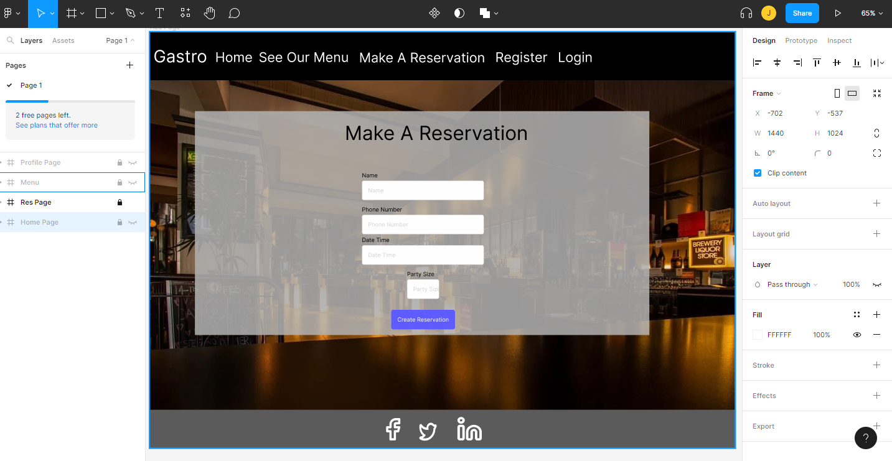

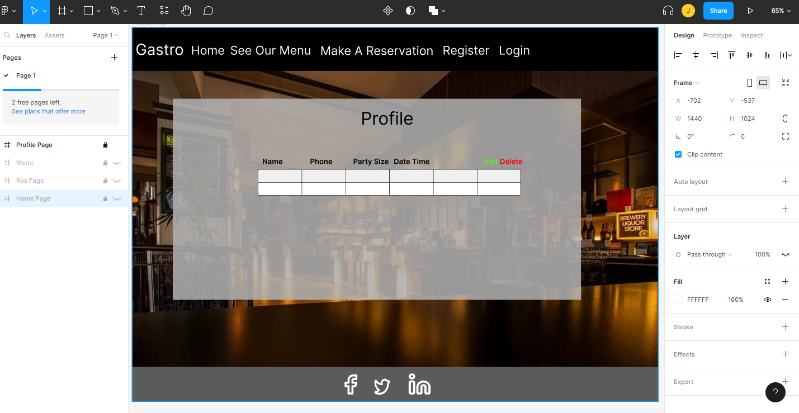

<h1>Design And Features</h1>
<ul>
    <li>Users can create reservations of up to 25 people for a 1 hour time frame.</li>
    <li>Reservation time slots are flexible as the database works out how many seats are available in that hour, e.g. 12:53-13:53.</li>
    <li>Users can create an account and have their own profile to store their reservation details where they can also edit and delete them.</li>
    <li>Staff accounts have CRUD functionality over users and reservations on the dJango admin pannel.</li>
    <li>There is a link to django admin for staff users in the nav bar.</li>
</ul>
<h2>Imagery</h2>
<ul>
    <li>The main background image is a bar, It looks warm, inviting and sophisticated, giving the user an expectation of warm high quality restaurant.</li>
</ul>
<h2>Site colors</h2>
<ul>
    <li>The color sheme is grey, black and white. These colors compliment the background image of a warm and welcoming restaurant.</li>
    <li>The Menu page is designed to look like chalk on a chalk board like you would see in a rustic restaurant.</li>
</ul>

<h2>Font styles</h2>
<ul>
    <li>Quicksand - is the main font because its clear and easy to read.</li>
    <li>Walter Turncoat - is for the menu page text to make it look like chalk.</li>
    <li>Fondamento - is for the logo and page headings, It gives a rustic feel to the webpage.</li>
</ul>

<h2>Navigation</h2>

The user navigates through the site with the buttons on screen and the navbar.  
The user will know where they are on the site as each page has a header displaying the page name. apart from the landing page.

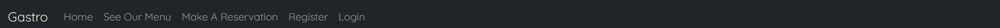

<h2>Logo</h2>

The logo is the name of the restaurant. It sits in the top left on the page in each window and when you click on it you go to the homepage.

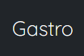

<h2>Reservation form</h2>

The reservation form collects the users name, phone number, date and time they want to reserve for and the amount of seats to reserve.

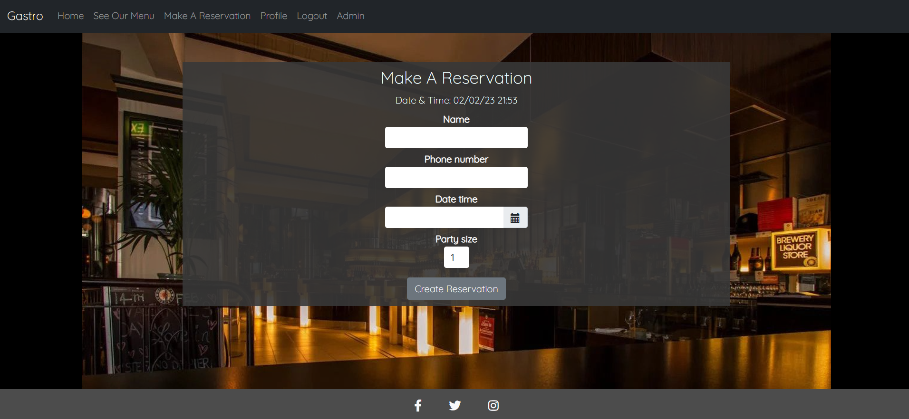

<h2>Profile page</h2>

On the profile page the user can see their reservation information for all reservations they have created in creation date order - newest first.   The user can edit or delete their reservations from this page.

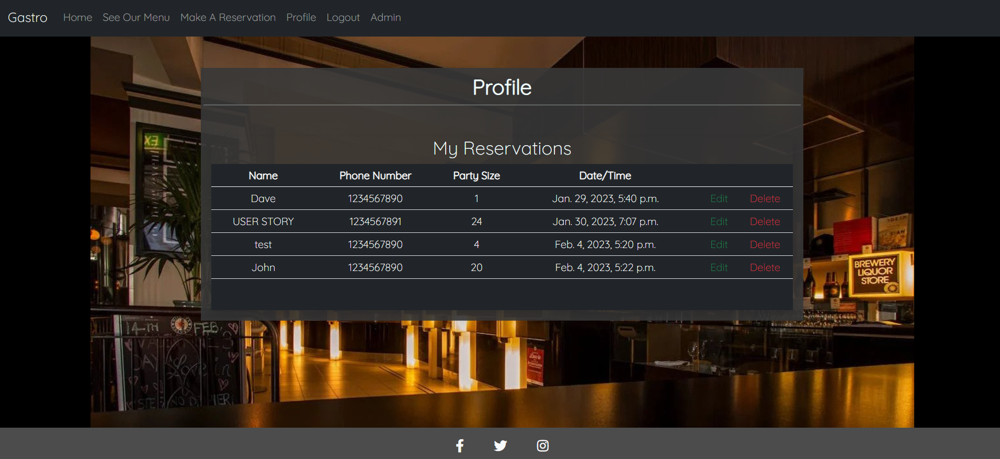

<h2>Footer</h2>

The Footer floats on the bottom of the screen showing the user all the social media links to the company.  
The Footer is designed not to be obtrusive to the user by being dark and thin with minimal content.

<h2>Future features</h2>
<ul>
    <li>I would like to add a menu favourites to the profile page so users can add their menu preferences.</li>
    <li>I would like to add auto reservation deletion after 5 days.</li>
</ul>

<h1>Technologies Used</h1>
<ul>
    <li>Python 3 - coding language.</li>
    <li>Django - coding framework.</li>
    <li>HTML & CSS - markup language.</li>
    <li>Bootstrap 5 - CSS framework and toolkit.</li>
    <li>JavaScript - coding language.</li>
    <li>jQuery - coding framework.</li>
    <li>Git - version control by utilizing the Gitpod terminal to add, commit and Push to GitHub.</li>
    <li>Git Hub - stores the project code and hosts the website.</li>
    <li>Visual Code Studio - system used to write code via Git.</li>
    <li>Paint 3D - to create the logo and edit screenshots for the README.md</li>
    <li>Heroku - for hosting the python code and downloading requirements.</li>
    <li>Pep8 - testing code.</li>
    <li>Chrome Dev Tools - to action, review and test changes without having to commit and push to the website each time.</li>
    <li>Lighthouse - testing code.</li>
    <li>W3C Validation - testing code.</li>
    <li>AWS - amazon hosting service S3 hosts the required static files.</li>
    <li>Database - elephantSQL.</li>
    <li>Pytest - Automated testing.</li>
    <li>Figma - Wireframes for design.</li>
</ul>

<h1>Deployment</h1>
<h2>Heroku</h2>
The project was deployed to Heroku via GitHub by:
<ol>
    <li>Logging Into Heroku, creating a new project, going to the settings page and adding the required variables.</li>
    <ul>
        <strong>Variables required:</strong>
        <li>AWS_ACCESS_KEY_ID - links AWS to heroku.</li>
        <li>AWS_SECRET_ACCESS_KEY - links AWS to heroku.</li>
        <li>DATABASE_URL - links database to heroku.</li>
        <li>SECRET_KEY - authorises heroku to use the app.</li>
        <li>USE_AWS - tells heroku to use AWS to serve static files.</li>
    </ul>
    <li>Going to deploy, selecting deployment method as GitHub and typing in the GitHub repository name.</li>
    <li>Finally selecting deploy branch to manually deploy or select automatic deployment which allows Heroku to rebuild the project after each push to GitHub.</li>
</ol>
!Important make sure to set Debug in the settings.py file to False.  
The page is now published and the link is in the settings section under Domains.

 

<h2>Making a Local Clone</h2>
<ol>
    <li>Log in to GitHub and locate the [GitHub Repository](https://github.com/)</li>
    <li>Under the repository name, click "Clone or download".</li>
    <li>To clone the repository using HTTPS, under "Clone with HTTPS", copy the link.</li>
    <li>Open Git Bash</li>
    <li>Change the current working directory to the location where you want the cloned directory to be made.</li>
    <li>Type `git clone`, and then paste the URL you copied in Step 3.</li>
    <li>Press Enter. Your local clone will be created.</li>
    <li>Create a new Heroku app and follow the steps in Heroku deployment above.</li>
</ol>

Click [Here](https://help.github.com/en/github/creating-cloning-and-archiving-repositories/cloning-a-repository#cloning-a-repository-to-github-desktop) for retrieve pictures and more detailed explanations of the above process.
    

<h1>Testing</h1>
<h2>Manual test</h2>
<ul>
    <li>Given invalid input such as letters and incorrect amount of data - both resulting in a error message as expected.</li>
    <li>Tried submitting blank forms - resulting in error messages as expected.</li>
    <li>Tried submitting reservation exceeding seat limit - request resulting in error messages as expected.</li>
    <li>Tried submitting reservation in a past date - resulting in error messages as expected.</li>
</ul>
<h2>Browsers</h2>
<ul>
    <li>Google Chrome</li>
    <li>Microsoft Edge</li>
    <li>Mozilla Firefox</li>
</ul>
<h2>Devices</h2>
<ul>
    <li>Galaxy S8</li>
    <li>Galazy S21 Ultra</li>
    <li>Iphone SE</li>
    <li>Iphone 4</li>
    <li>Iphone 12 Pro</li>
    <li>Ipad Air</li>
    <li>Surface Pro 7</li>
    <li>Laptop</li>
    <li>Nest Hub max</li>
</ul>

<h2>Software Tests</h2>
<ul>
    <li><a href="https://search.google.com/test/mobile-friendly" target="_blank" rel="noopener">Google mobile friendly test Service</a></li>

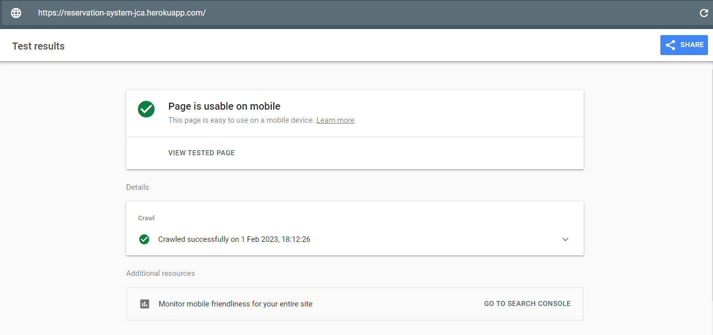
    <li><a href="https://validator.w3.org/" target="_blank" rel="noopener">W3C Markup Validation Service</a></li>

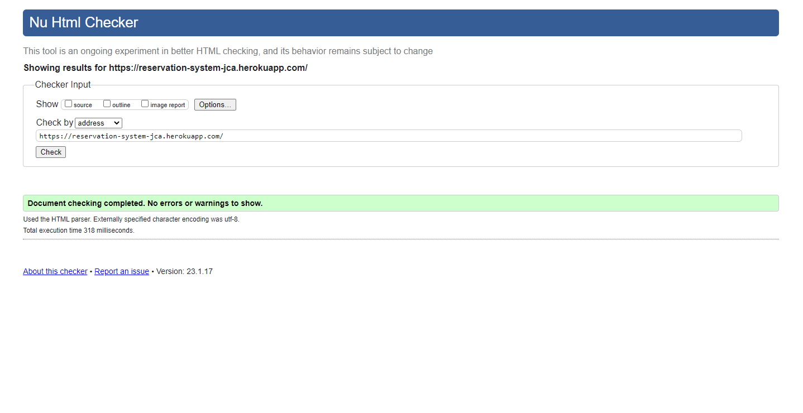
    <li><a href="https://jigsaw.w3.org/css-validator/" target="_blank" rel="noopener">W3C CSS Validation Service</a></li>

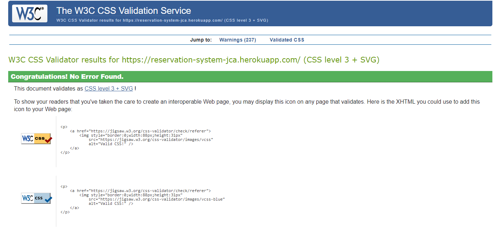
    <li><a href="https://developers.google.com/web/tools/lighthouse" target="_blank" rel="noopener">Google Chrome Lighthouse</a></li>

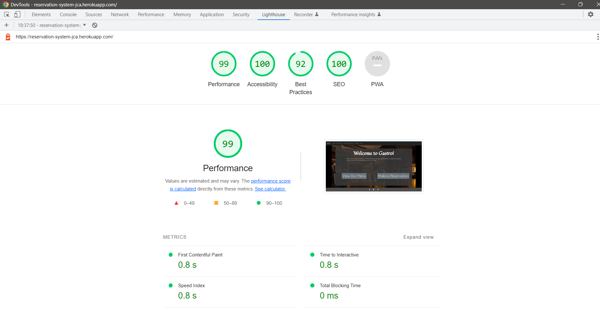
    <li><a href="https://jshint.com/" target="_blank" rel="noopener">JSHint Javascript Validation Service</a></li>

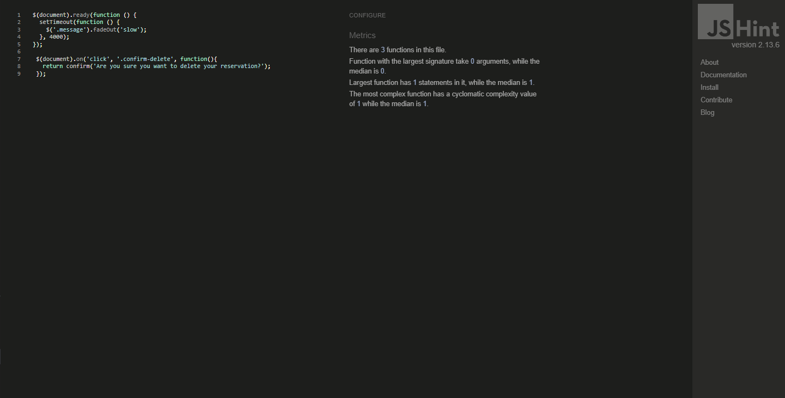
</ul>
<h2>Unit Tests</h2>

Additionally I ran some automated tests.

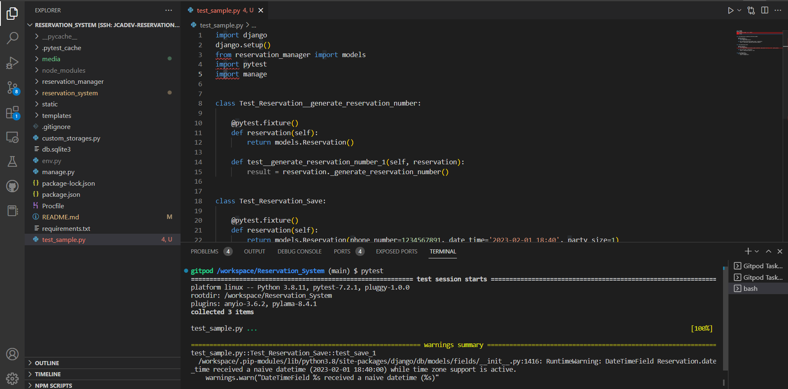
<h2>Bugs & Fixes</h2>
<ul>
   <li>Mobile display - various pages font content was too big causing the text to display further than the screen width so the user would have to side scroll on the page ruining the UX. - fix added extra @media to the css scaling font size and adjusting the flex types on forms.</li>
   <li>Footer - the footer was overlapping buttons and content. - fix I used a div to create an empty space above the footer.</li>
   <li>Forms - the forms on mobile platforms wouldn't align. - fix I added extra media queries to the css for smaller screen width and changed the way the form was flex wrapped.</li>
</ul>

<h2>Known Bugs</h2>
<ul>
    <li>On mobile display opening the dropdown menu while a message is displayed shows the message overlapping the menu options.</li>
</ul>

<h2>Sources/Credits</h2>

<ul>
    <li>My Mentor for her feedback</li>
    <li>Gathered information and troubleshooting from <a href="https://stackoverflow.com/" target="_blank" rel="noopener">Stackoverflow</li>
    <li>background image from <a href="https://www.pexels.com/" target="_blank" rel="noopener">Pexels</a></li>
    <li>Icons from <a href="https://fontawesome.com/search?o=r&m=free" target="_blank" rel="noopener">fontawesome</a></li>
